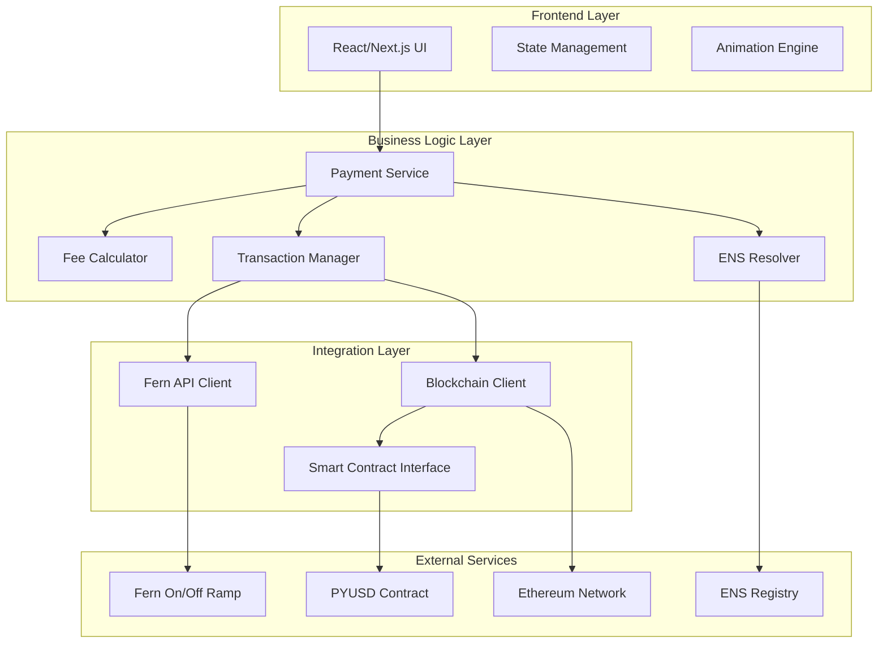
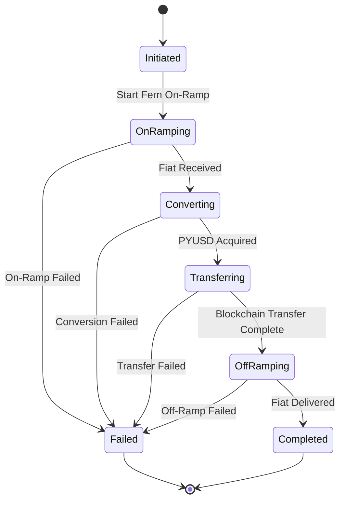

# Design Document

## Overview

The International Payment App is a Next.js-based web application that provides one-click international money transfers using blockchain technology. The system abstracts away the complexity of cryptocurrency transactions while providing users with a simple, beautiful interface for sending money globally.

The application follows a microservices-inspired architecture with clear separation between the frontend presentation layer, business logic services, blockchain integration layer, and external API integrations. The design prioritizes user experience, security, and scalability while maintaining the ability to mock external services during development.

## Architecture

### High-Level Architecture



### Technology Stack

- **Frontend**: Next.js 15.4.6 with React 19.1.0
- **Styling**: Tailwind CSS 4 for responsive design and animations
- **Blockchain**: ethers.js for Ethereum interactions
- **State Management**: React Context API with useReducer for complex state
- **Animations**: Framer Motion for smooth UI animations
- **API Integration**: Custom API clients for Fern and blockchain services
- **Development**: TypeScript for type safety

## Components and Interfaces

### Frontend Components

#### PaymentForm Component
```typescript
interface PaymentFormProps {
  onSubmit: (payment: PaymentRequest) => void;
  isLoading: boolean;
}

interface PaymentRequest {
  amount: number;
  currency: string;
  recipientAddress: string;
  recipientENS?: string;
}
```

#### FeeEstimator Component
```typescript
interface FeeEstimate {
  onRampFee: number;
  blockchainFee: number;
  offRampFee: number;
  totalFee: number;
  estimatedTime: number; // in minutes
}
```

#### TransactionHistory Component
```typescript
interface Transaction {
  id: string;
  timestamp: Date;
  amount: number;
  currency: string;
  recipient: string;
  status: TransactionStatus;
  fees: FeeEstimate;
  txHash?: string;
}

enum TransactionStatus {
  PENDING = 'pending',
  ON_RAMPING = 'on_ramping',
  CONVERTING = 'converting',
  TRANSFERRING = 'transferring',
  OFF_RAMPING = 'off_ramping',
  COMPLETED = 'completed',
  FAILED = 'failed'
}
```

### Business Logic Services

#### PaymentService
```typescript
class PaymentService {
  async initiatePayment(request: PaymentRequest): Promise<Transaction>;
  async getTransactionStatus(id: string): Promise<TransactionStatus>;
  async getTransactionHistory(): Promise<Transaction[]>;
}
```

#### FeeCalculator
```typescript
class FeeCalculator {
  async calculateFees(amount: number, currency: string): Promise<FeeEstimate>;
  async getEstimatedTime(): Promise<number>;
}
```

#### ENSResolver
```typescript
class ENSResolver {
  async resolveENS(ensName: string): Promise<string | null>;
  async reverseResolve(address: string): Promise<string | null>;
}
```

### Smart Contract Interface

#### PaymentContract
```solidity
contract PaymentContract {
    function initiatePayment(
        address recipient,
        uint256 amount,
        bytes32 paymentId
    ) external;
    
    function getPaymentStatus(bytes32 paymentId) 
        external view returns (PaymentStatus);
    
    event PaymentInitiated(
        bytes32 indexed paymentId,
        address indexed sender,
        address indexed recipient,
        uint256 amount
    );
    
    event PaymentCompleted(
        bytes32 indexed paymentId,
        uint256 timestamp
    );
}
```

## Data Models

### Payment Flow State Machine



### Database Schema (Local Storage)

```typescript
interface StoredTransaction {
  id: string;
  createdAt: string;
  updatedAt: string;
  amount: number;
  currency: string;
  recipient: string;
  recipientENS?: string;
  status: TransactionStatus;
  fees: FeeEstimate;
  txHash?: string;
  fernOnRampId?: string;
  fernOffRampId?: string;
  paymentContractId?: string;
}
```

## Error Handling

### Error Types and Recovery Strategies

1. **Network Errors**
   - Retry with exponential backoff
   - Display user-friendly error messages
   - Provide manual retry options

2. **Fern API Errors**
   - Handle rate limiting gracefully
   - Provide fallback to manual processes
   - Cache successful responses

3. **Blockchain Errors**
   - Handle gas estimation failures
   - Provide gas price recommendations
   - Support transaction replacement

4. **ENS Resolution Errors**
   - Fallback to manual address entry
   - Validate address formats
   - Provide address book functionality

### Error Handling Architecture

```typescript
class ErrorHandler {
  static handleFernError(error: FernError): UserFriendlyError;
  static handleBlockchainError(error: BlockchainError): UserFriendlyError;
  static handleENSError(error: ENSError): UserFriendlyError;
}

interface UserFriendlyError {
  message: string;
  recoveryAction?: string;
  retryable: boolean;
}
```

## Testing Strategy

### Unit Testing
- **Components**: Test all React components with React Testing Library
- **Services**: Mock external dependencies and test business logic
- **Utilities**: Test helper functions and data transformations
- **Smart Contracts**: Use Hardhat for contract testing

### Integration Testing
- **API Integration**: Test Fern API client with mock responses
- **Blockchain Integration**: Test against local blockchain networks
- **End-to-End Flows**: Test complete payment flows with mocked services

### Mock Implementation Strategy

#### Development Mode Configuration
```typescript
interface AppConfig {
  mode: 'development' | 'production';
  useMockServices: boolean;
  fernApiUrl: string;
  blockchainRpcUrl: string;
}
```

#### Mock Services
```typescript
class MockFernService implements FernAPIClient {
  async initiateOnRamp(amount: number): Promise<OnRampResponse> {
    // Simulate realistic delays and responses
    await delay(2000);
    return {
      id: generateMockId(),
      status: 'pending',
      estimatedCompletion: Date.now() + 300000 // 5 minutes
    };
  }
}

class MockBlockchainService implements BlockchainClient {
  async sendPYUSD(to: string, amount: number): Promise<TransactionResponse> {
    await delay(1000);
    return {
      hash: generateMockTxHash(),
      status: 'pending'
    };
  }
}
```

### Performance Testing
- **Load Testing**: Simulate multiple concurrent payments
- **Animation Performance**: Ensure smooth 60fps animations
- **Bundle Size**: Optimize for fast loading times

### Security Testing
- **Input Validation**: Test all user inputs for security vulnerabilities
- **Smart Contract Auditing**: Formal verification of contract logic
- **API Security**: Test authentication and authorization flows

## UI/UX Design Specifications

### Animation Framework
- **Page Transitions**: Smooth slide and fade animations between views
- **Loading States**: Animated progress indicators for each payment stage
- **Micro-interactions**: Button hover effects, form field focus animations
- **Success/Error States**: Celebratory animations for successful payments

### Responsive Design
- **Mobile-First**: Optimized for mobile payment scenarios
- **Progressive Enhancement**: Enhanced features for larger screens
- **Touch-Friendly**: Large touch targets and gesture support

### Accessibility
- **WCAG 2.1 AA Compliance**: Full accessibility support
- **Screen Reader Support**: Proper ARIA labels and descriptions
- **Keyboard Navigation**: Complete keyboard accessibility
- **High Contrast Mode**: Support for users with visual impairments